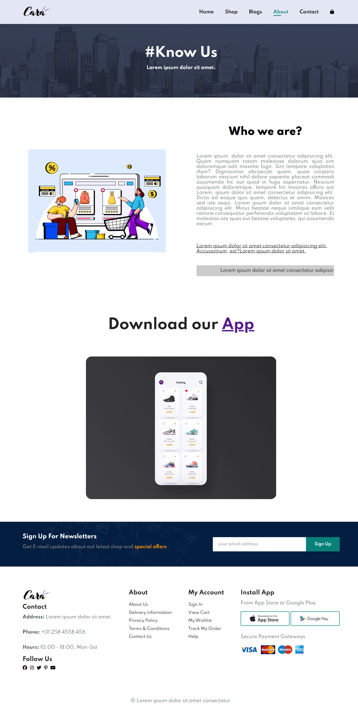
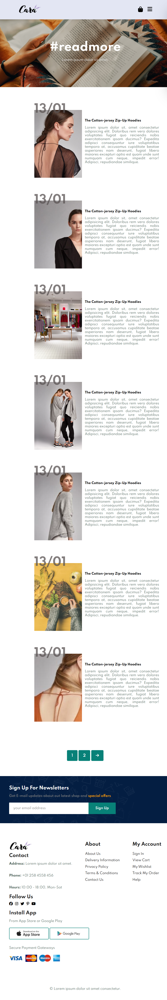
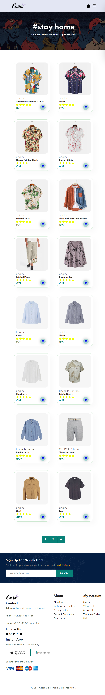
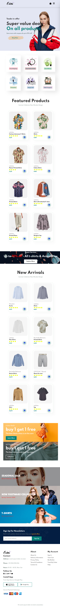

## 🛍️ Branded Clothes E-commerce Website
# Welcome to the Branded Clothes E-commerce Website — an online store offering high-quality clothes at affordable prices! This project was built using HTML, CSS, and JavaScript to deliver a smooth and user-friendly shopping experience.

**🚀 Features**
-  Beautiful and responsive design
-  Browse branded clothes by category
-  Add items to cart
-  View cart summary
-  Checkout process (static)
-  Mobile-friendly layout
- Smooth animations and transitions

**💻 Technologies Used**
- HTML5 → semantic and accessible markup
- CSS3 → modern, responsive design
- JavaScript (Vanilla JS) → interactivity, cart logic, DOM manipulation

**📸 Screenshots**
.png>)    

**🔧 Installation**
Clone the repository

```bash
git clone https://github.com/Harsh-P30/E-commerce.git
```
# Navigate to the project folder

- cd your-repo-name
- Open index.html in your browser


# Open with your preferred browser**
**📂 Project Structure**

/project-root <br>
│<br>
├── index.html<br>
├── blog.html<br>
├── about.html<br>
├── contact.html<br>
├── cart.html<br>
├── shop.html<br>
├── wait.html<br>
├── style.css<br>
├── script.js<br>
├── /images<br>
└── README.md<br>

# ✨ Future Improvements
- Add backend with payment gateway
- Implement user authentication (login/signup)
- Integrate product search and filters
- Add product reviews and ratings

# 📬 Contact
- If you have any suggestions or feedback, feel free to reach out!

Harsh Prasad

GitHub:  https://github.com/Harsh-P30

Email:harshprasad1204@gmail.com

💖 Acknowledgments
Thanks to everyone who inspired this project, and to the open-source community for providing valuable resources.

